🧠 Strategic Copilot

Causal Decision Intelligence & AI Executive Assistant

<strong>From correlation → causation → simulation → strategic decision</strong>

  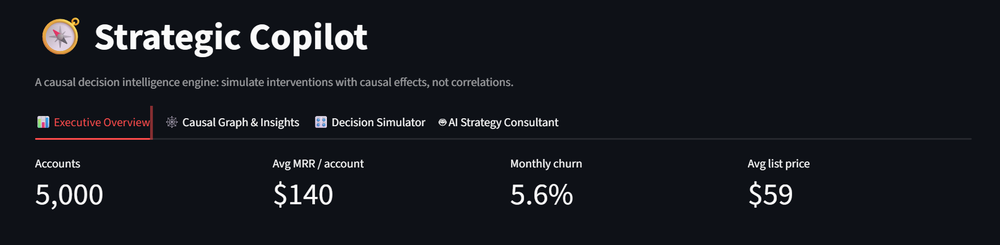

  <em>

A decision intelligence platform that combines causal inference, probabilistic simulation,

and LLM-powered strategic analysis to evaluate business interventions before budget is committed.

  </em>

🚀 Overview

Strategic Copilot is an end-to-end Causal Decision Intelligence platform designed to help SaaS decision-makers understand not only what happened, but also:

"What is likely to happen if we change something?"

Traditional business analytics often relies on observational correlations:

"Companies that spend more on advertising generate more revenue."

But correlation does not necessarily imply causation.

Strategic Copilot addresses this problem by combining:

📊 Exploratory & observational analytics

🔗 Structural causal modeling

🧠 DoWhy causal validation

🤖 EconML Double Machine Learning

🎲 Monte Carlo decision simulation

📈 Probabilistic risk analysis

💬 LLM-powered executive strategy generation

⚡ Groq API + Llama 3.3 70B

🖥️ Interactive Streamlit application

The result is a workflow that moves from:

Data → Observation → Causal Effect → Intervention → Simulation → Business Decision

🎯 Why Strategic Copilot?

A typical analytics workflow answers:

"What happened?"

A predictive ML system answers:

"What is likely to happen?"

Strategic Copilot attempts to answer the more decision-oriented question:

"What could happen if we intervene?"

For example:

Business Question

What happens if monthly advertising spend increases by 20%?

Instead of simply observing historical relationships, Strategic Copilot:

Identifies potential confounders.

Defines a causal graph.

Estimates the treatment effect.

Removes observable confounding using Double Machine Learning.

Simulates thousands of possible outcomes.

Estimates financial impact and churn risk.

Converts the results into an executive-friendly strategic recommendation.

⭐ Key Capabilities

Capability

Description

📊 Exploratory Analytics

Analyze SaaS revenue, MRR, churn, advertising spend and customer segments

🔗 Causal Modeling

Build explicit causal relationships using DAGs

🧠 Double Machine Learning

Estimate treatment effects while controlling for observed confounders

🧪 Causal Validation

Apply DoWhy identification and refutation techniques

🎲 Monte Carlo Simulation

Run 5,000 simulations to model uncertainty

📈 Risk Analysis

Examine expected, conservative and optimistic outcomes

💬 AI Strategy Consultant

Generate executive-level strategy memos using Llama 3.3 70B

🎛️ Interactive Decisions

Change pricing, advertising spend and simulation parameters

🖥️ Streamlit UI

Explore the entire decision workflow through an interactive dashboard

🏗️ System Architecture

                         ┌──────────────────────┐

                         │   SaaS Customer Data │

                         └──────────┬───────────┘

                                    │

                                    ▼

                    ┌─────────────────────────────┐

                    │ Exploratory Data Analysis   │

                    │                             │

                    │ MRR • Churn • Ad Spend     │

                    │ Customer Segments • Trends  │

                    └──────────────┬──────────────┘

                                   │

                                   ▼

                    ┌─────────────────────────────┐

                    │      Causal Discovery       │

                    │                             │

                    │ DAGs • Confounders • SCMs  │

                    └──────────────┬──────────────┘

                                   │

                                   ▼

              ┌────────────────────────────────────────┐

              │       Causal Effect Estimation         │

              │                                        │

              │       DoWhy + EconML DML               │

              │                                        │

              │     Naive OLS → Causal Adjustment      │

              └────────────────────┬───────────────────┘

                                   │

                                   ▼

                    ┌─────────────────────────────┐

                    │   Policy Intervention       │

                    │                             │

                    │ Ad Spend ↑ / ↓              │

                    │ Price ↑ / ↓                  │

                    └──────────────┬──────────────┘

                                   │

                                   ▼

                    ┌─────────────────────────────┐

                    │   Monte Carlo Simulation    │

                    │                             │

                    │       5,000 simulations     │

                    └──────────────┬──────────────┘

                                   │

                    ┌──────────────┴──────────────┐

                    ▼                             ▼

          ┌──────────────────┐          ┌──────────────────┐

          │ Financial Impact │          │   Churn Risk     │

          │      ($)         │          │       (%)        │

          └────────┬─────────┘          └────────┬─────────┘

                   │                             │

                   └──────────────┬──────────────┘

                                  ▼

                    ┌─────────────────────────────┐

                    │     AI Strategy Consultant  │

                    │                             │

                    │ Groq API + Llama 3.3 70B   │

                    └──────────────┬──────────────┘

                                   │

                                   ▼

                    ┌─────────────────────────────┐

                    │ Executive Decision Memo     │

                    │ & Strategic Interpretation   │

                    └─────────────────────────────┘

📸 Product Tour

1️⃣ Executive Overview & Exploratory Analysis

The first stage establishes the observational baseline before any causal adjustment.

It provides:

Total customer accounts

Mean Monthly Recurring Revenue

Churn rate

List pricing

Historical MRR trends

Historical churn trends

Interactive variable exploration

Raw treatment-outcome relationships

Correlation analysis

Executive KPI Dashboard

  

MRR & Churn Trends

 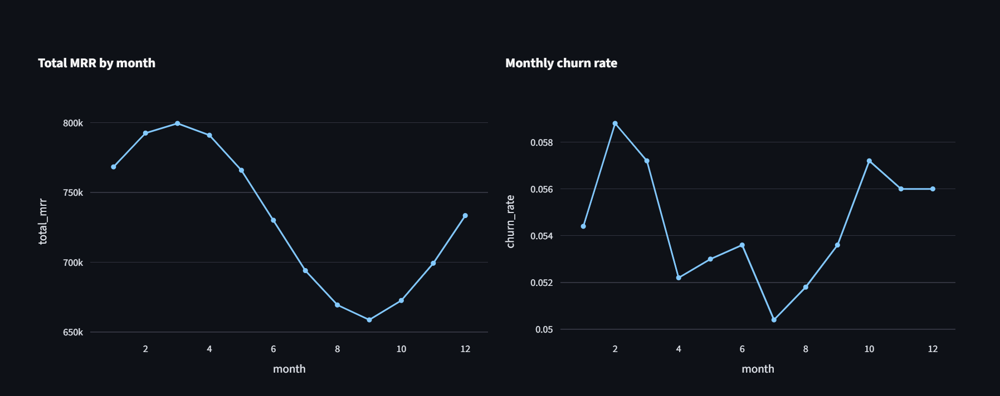 

Historical 12-month trends provide visibility into baseline seasonality and business performance.

Interactive Data Explorer

 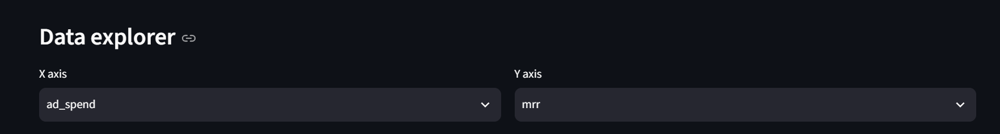 

Users can dynamically select variables and explore relationships across the customer portfolio.

Observational Relationship

 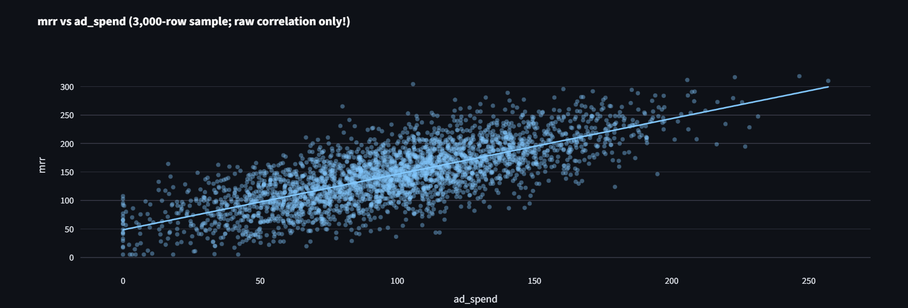 

The raw relationship between advertising spend and MRR provides the initial observational hypothesis.

However:

An observational relationship is not necessarily a causal relationship.

Correlation & Confounding

 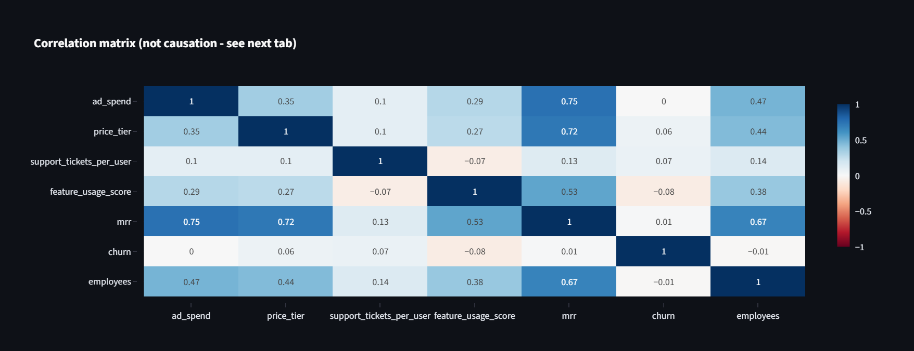 

The correlation matrix helps identify potential confounders.

For example, company size may influence both:

Advertising spend

Revenue / MRR

This creates the possibility of confounding bias in a naive regression.

2️⃣ Causal Discovery & Estimation

The second stage moves from correlation to causal inference.

Strategic Copilot explicitly defines relationships between:

Treatment variables

Outcomes

Confounders

Potential intervention paths

Directed Acyclic Graph

 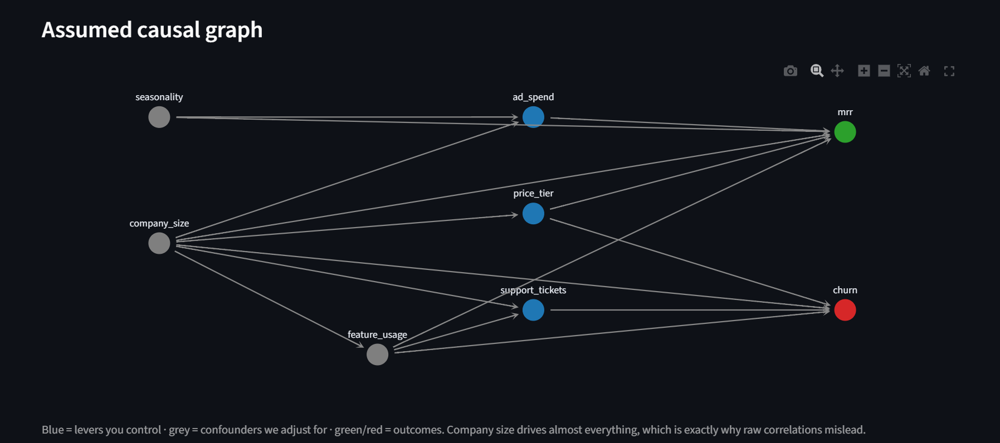 

The DAG provides an explicit representation of the assumed causal structure.

This makes the causal assumptions visible instead of hiding them inside a black-box model.

Naive vs Causal Estimates

 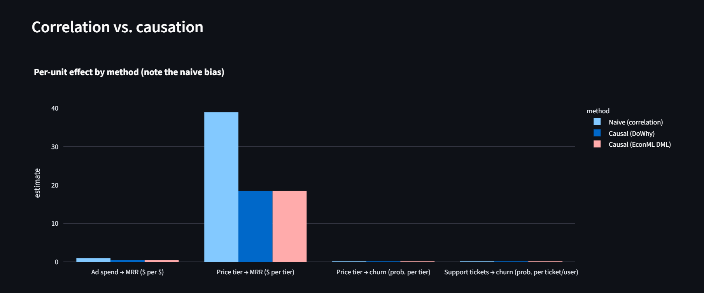 

Strategic Copilot compares:

Naive OLS

↓

Observational Estimate

DoWhy

↓

Causal Identification + Validation

EconML DML

↓

Confounder-Adjusted Treatment Effect

This allows the user to see how the estimated effect changes after causal adjustment.

Causal Diagnostics

 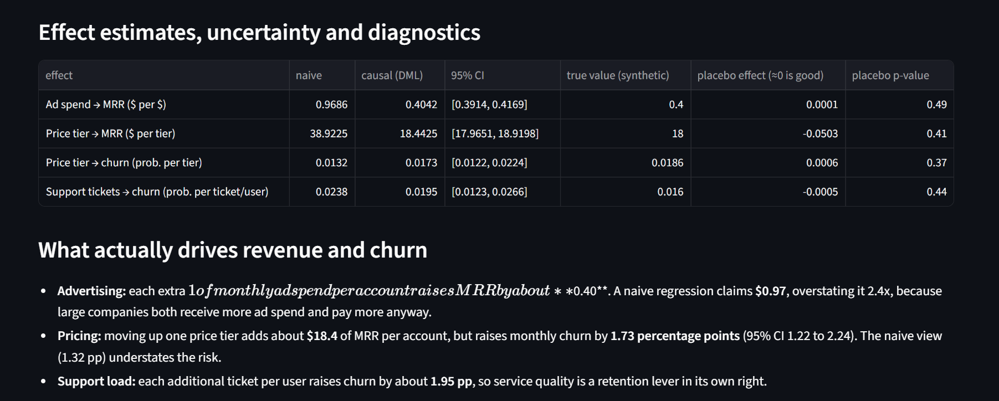 

The diagnostics layer reports:

Treatment effect estimates

Confidence intervals

Synthetic ground-truth benchmarks

Refutation tests

Placebo sensitivity checks

This provides an additional layer of validation around the estimated causal relationship.

3️⃣ Decision Intelligence & Monte Carlo Simulation

Once the causal effect has been estimated, Strategic Copilot converts it into a decision simulation problem.

Instead of asking:

"What was the historical relationship?"

the system asks:

"What could happen if we change the policy?"

Policy Intervention Controls

 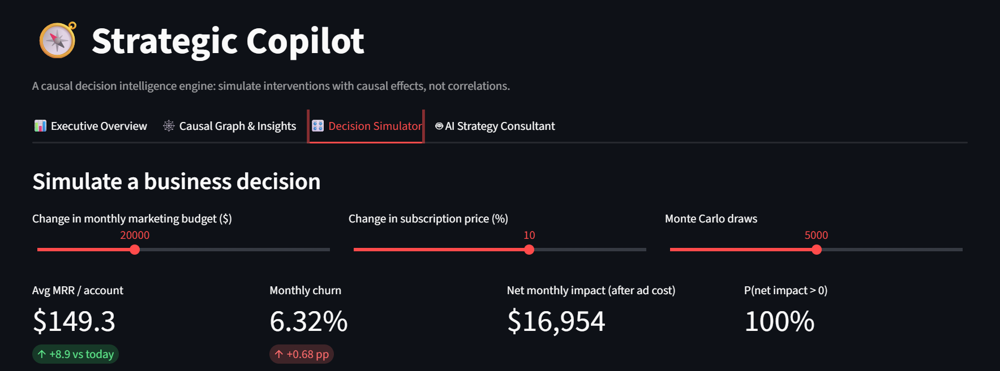 

Users can interactively modify:

Monthly advertising spend

Pricing changes

Simulation draw count

Intervention parameters

Monte Carlo Outcome Distributions

 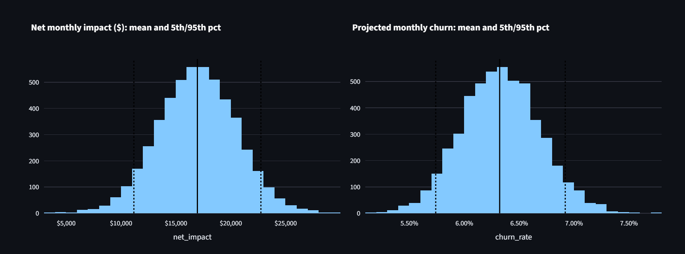 

Rather than producing a single deterministic prediction, the system generates a distribution of possible outcomes.

Two key outputs are simulated:

💰 Net Monthly Financial Impact

The distribution estimates the range of potential financial impact under the selected intervention.

📉 Projected Monthly Churn

The simulation also estimates the distribution of potential churn outcomes.

This enables decision-makers to reason about:

Expected outcome + uncertainty + downside risk + upside potential

Risk & Percentile Analysis

 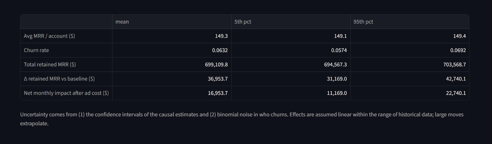 

The simulator summarizes:

Metric    Interpretation

Mean Expected simulated outcome

5th Percentile Conservative downside scenario

95th Percentile     Optimistic upside scenario

This is particularly useful for evaluating decisions under uncertainty rather than relying on a single point estimate.

4️⃣ 🤖 AI Strategy Consultant

The final layer converts quantitative analysis into an executive-friendly narrative.

 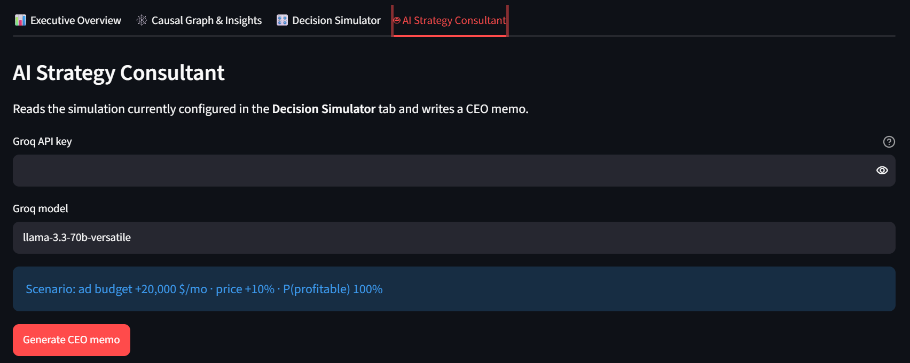 

The AI Strategy Consultant integrates:

Causal Estimate

   +

Simulation Results

   +

Risk Distribution

   ↓

LLM Strategy Agent

   ↓

Executive Decision Memo

The system uses:

Groq API + Llama 3.3 70B

to transform quantitative simulation outputs into a structured strategic narrative.

The objective is not to let the LLM calculate the causal effect.

Instead:

The analytical engine produces the evidence.

The LLM translates the evidence into executive language.

This separation keeps quantitative estimation and narrative generation conceptually distinct.

📐 Mathematical Framework

Double Machine Learning

Traditional regression can suffer from omitted-variable bias when a confounder (X) influences both the treatment (T) and outcome (Y).

Strategic Copilot uses the residualization framework behind Double Machine Learning:

$$ Y - \mathbb{E}[Y|X] = \theta \left( T - \mathbb{E}[T|X] \right) + \epsilon $$

Where:

(Y) = outcome variable

(T) = treatment/intervention

(X) = observed confounders

(\theta) = estimated treatment effect

(\epsilon) = residual error

The machine learning models estimate:

$$ \mathbb{E}[Y|X] $$

and

$$ \mathbb{E}[T|X] $$

The residualized treatment and outcome are then used to estimate the treatment effect while controlling for observed confounding.

Monte Carlo Decision Simulation

Strategic Copilot uses 5,000 simulation draws to model uncertainty around policy outcomes.

The simulation incorporates uncertainty in the estimated treatment effect together with outcome variability.

Conceptually:

$$ Y^{(i)}{sim} \sim Distribution \left( \hat{\theta}, \sigma{\hat{\theta}}, p_{churn}, N_{accounts} \right) $$

The resulting distribution is used to calculate:

Expected financial impact

Downside scenarios

Upside scenarios

Churn distributions

Percentile-based risk boundaries

This allows the system to move from:

Single Forecast

  ↓

Probability Distribution

  ↓

Risk-Aware Decision

🧪 Causal Inference Workflow

Strategic Copilot follows the following analytical pipeline:

Raw SaaS Data

     │

     ▼

Exploratory Analysis

     │

     ▼

Identify Potential Confounders

     │

     ▼

Define Causal DAG

     │

     ▼

Causal Identification

     │

     ▼

DoWhy Estimation & Validation

     │

     ▼

EconML Double Machine Learning

     │

     ▼

Treatment Effect

     │

     ▼

Policy Intervention

     │

     ▼

5,000 Monte Carlo Simulations

     │

     ▼

Risk Distribution

     │

     ▼

AI Strategy Consultant

     │

     ▼

Executive Decision Memo

🛠️ Technology Stack

Frontend & Dashboard

Streamlit

Plotly

Graphviz

Causal Inference

DoWhy

EconML

Double Machine Learning

Structural Causal Models

Machine Learning

Scikit-Learn

LightGBM

Statsmodels

Data Processing

Pandas

NumPy

Simulation

Monte Carlo Simulation

Probability Distributions

Percentile / Risk Analysis

LLM Integration

Groq API

Llama 3.3 70B

Development

Python 3.10+

Git

Virtual Environments

📂 Repository Structure

strategic-copilot/

│

├── assets/

│   ├── 01_executive_overview.png

│   ├── 02_mrr_churn_trends.png

│   ├── 03_data_explorer_controls.png

│   ├── 04_naive_scatter.png

│   ├── 05_correlation_heatmap.png

│   ├── 06_causal_dag.png

│   ├── 07_effect_comparison_barchart.png

│   ├── 08_causal_diagnostics_table.png

│   ├── 09_decision_simulator_controls.png

│   ├── 10_monte_carlo_distributions.png

│   ├── 11_simulation_percentiles_table.png

│   └── 12_ai_consultant_interface.png

│

├── data/

│   └── saas_customer_data.csv

│

├── src/

│   ├── causal_engine.py

│   ├── simulation.py

│   └── llm_agent.py

│

├── app.py

├── requirements.txt

└── README.md

⚡ Quick Start

Prerequisites

Python 3.10+

Git

A Groq API key for the AI Strategy Consultant (optional)

1. Clone the Repository

git clone https://github.com/Git-Saurav-Khyalia/strategic-copilot.git
cd strategic-copilot

2. Create a Virtual Environment

Windows — PowerShell

python -m venv venv
.\venv\Scripts\Activate.ps1

Windows — Command Prompt

python -m venv venv
venv\Scripts\activate.bat

macOS / Linux

python3 -m venv venv
source venv/bin/activate

3. Install Dependencies

python -m pip install --upgrade pip
pip install -r requirements.txt

4. Launch the Application

streamlit run app.py

The application will open in your browser.

🔐 AI Strategy Consultant Configuration

The AI Strategy Consultant requires a Groq API key.

You can provide the key through the application interface or configure it using an environment variable.

Example:

GROQ_API_KEY="your_groq_api_key_here"

⚠️ Never commit your API key to GitHub.

If using a .env file, add it to .gitignore.

📊 Example Decision Workflow

Imagine a SaaS company is considering increasing advertising expenditure.

Step 1 — Observe

Historical data shows:

Ad Spend ↑

 ↓

MRR ↑

But this relationship may be influenced by:

Company Size

 ↓

┌───┴────┐

▼        ▼

Ad Spend  MRR

Step 2 — Model the Causal Structure

A DAG is constructed to explicitly represent the assumed relationships.

Step 3 — Estimate the Causal Effect

DoWhy and EconML are used to estimate the treatment effect while accounting for observed confounding.

Step 4 — Simulate the Intervention

The decision-maker can increase advertising spend and run thousands of simulations.

Step 5 — Evaluate Risk

Instead of:

"Revenue will increase by $X."

the system produces a distribution such as:

Expected Impact

   │

   ├── Conservative Scenario

   │

   ├── Expected Scenario

   │

   └── Optimistic Scenario

Step 6 — Generate an Executive Narrative

The AI Strategy Consultant converts the quantitative results into a concise strategic memo describing:

Expected impact

Risk

Uncertainty

Key assumptions

Strategic implications

🧠 What Makes This Different?

Strategic Copilot combines several analytical layers into one workflow:

            ┌─────────────────┐

            │   BI Analytics  │

            └────────┬────────┘

                     │

                     ▼

            ┌─────────────────┐

            │ Causal Inference│

            └────────┬────────┘

                     │

                     ▼

            ┌─────────────────┐

            │ Decision Sim.   │

            └────────┬────────┘

                     │

                     ▼

            ┌─────────────────┐

            │ AI Consultant   │

            └─────────────────┘

Rather than treating analytics, causal inference, simulation and generative AI as separate tools, Strategic Copilot connects them into a single decision workflow.

⚠️ Important Assumptions & Limitations

Causal inference does not automatically establish real-world causality.

The quality of the estimated effect depends on:

Correct specification of the causal graph

Availability of relevant confounders

Quality of the underlying data

Validity of modeling assumptions

Treatment variation

Correct interpretation of the intervention

In particular, Double Machine Learning can reduce bias from observed confounders, but it cannot automatically eliminate bias from important unobserved confounders.

The Monte Carlo simulator also produces scenario distributions based on the assumptions supplied to the model. These should therefore be interpreted as decision-support scenarios, not guaranteed forecasts.

🔮 Future Improvements

Potential extensions include:

Automated causal graph discovery

Treatment effect heterogeneity by customer segment

CATE estimation

Sensitivity analysis for unobserved confounding

Automated experiment / A-B test design

Bayesian decision modeling

Multi-treatment optimization

Automated scenario comparison

Decision history tracking

SQL / warehouse integration

Real-time SaaS metrics integration

Executive PDF report generation

Authentication & role-based access

Cloud deployment

📌 Project Highlights

End-to-end Causal Decision Intelligence platform

Interactive Streamlit application

DoWhy causal modeling & validation

EconML Double Machine Learning

Explicit causal DAGs

5,000-draw Monte Carlo simulation

Financial impact & churn risk distributions

Percentile-based decision analysis

Groq API + Llama 3.3 70B integration

Automated executive strategy narratives

👨‍💻 Author

Saurav Khyalia

B.Tech — Electronics & Communication Engineering

Interested in:

Data Analytics

Business Intelligence

Causal Inference

Decision Science

Machine Learning

AI-powered Analytics

⭐ If you found this project interesting

Feel free to explore the repository, experiment with the decision simulator, and examine how observational analytics can be connected with causal inference and probabilistic decision-making.